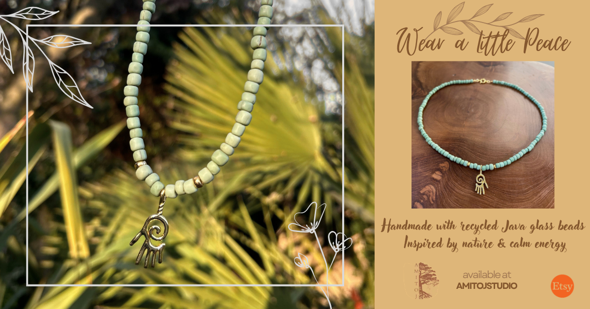
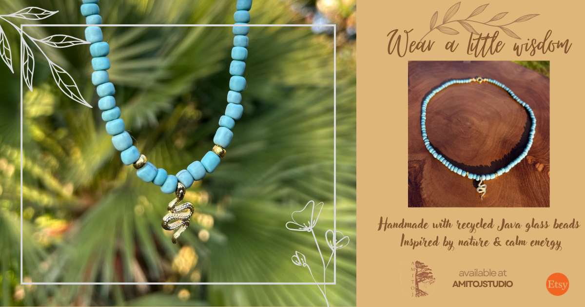
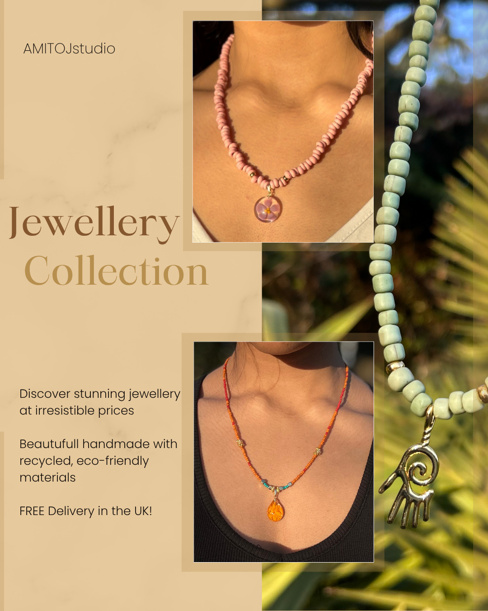

# Facebook Ads Case Study Creative Testing Optimisation on a 40 Budget

# 📌 Facebook Ads Case Study: Creative Testing & Optimisation

## 🎯 Overview
This project documents a 10-day Facebook Ads campaign focused on testing and optimising ad creatives to improve performance metrics such as Click-Through Rate (CTR) and Cost Per Click (CPC).

- **Total Budget:** £38.11  
- **Duration:** 27 March – 6 April  
- **Campaign Type:** Traffic (Landing Page Views)  
- **Structure:** 1 Campaign → 1 Ad Set → 3 Ads  

---

## 🎨 Ad Creatives

### 🟢 Green Necklace – Peace Theme (Original Winner)

- Product-focused creative  
- Nature-inspired design  
- Messaging centred on calmness and sustainability  

---

### 🟣 Blue Necklace – Wisdom Theme (Variant)

- Iteration of the winning concept  
- Same structure, different product and theme  
- Created to test scalability and improve efficiency  

---

### 🔵 Jewellery Collection – Lifestyle (Paused Early)

- Lifestyle-focused creative featuring multiple products  
- Broader messaging with less specific focus  

---

## 📊 Phase 1: Initial Results (Days 1–3)

| Metric | Lifestyle Ad | Green Necklace |
|-------|-------------|----------------|
| Impressions | 40 | 2,319 |
| Clicks | 1 | 85 |
| CTR | 2.50% | **3.67%** |
| CPC | £0.08 | £0.12 |
| Landing Page Views | 0 | **80** |

### 🔍 Insights
- The product-focused ad (Green Necklace) significantly outperformed the lifestyle ad  
- The lifestyle ad failed to scale due to low engagement and delivery  
- Early indication that **specific, product-led creatives perform better**

---

## 🔄 Optimisation Strategy (Day 4)

- Paused the underperforming lifestyle ad  
- Introduced a new variant (Blue Necklace) based on the winning concept  
- Reallocated budget to high-performing creatives  

---

## 📈 Final Results (End of Campaign)

### 🔹 Ad-Level Performance

| Ad | Impressions | Clicks | CTR | CPC | Landing Page Views | Cost per LPV |
|----|------------|--------|-----|-----|-------------------|--------------|
| Green Necklace | 5,460 | 205 | **3.75%** | £0.11 | 166 | £0.14 |
| Blue Necklace (Variant) | 4,183 | 148 | 3.54% | **£0.10** | 131 | **£0.12** |
| Lifestyle (Paused) | 59 | 2 | 3.39% | £0.11 | 1 | £0.21 |

---

### 🔹 Campaign Totals

- **Total Impressions:** 9,702  
- **Total Clicks:** 355  
- **Average CTR:** **3.66%**  
- **Average CPC:** **£0.11**  
- **Landing Page Views:** 298  
- **Average Cost per LPV:** **£0.13**  

---

## 📊 Key Insights

- **Product-focused creatives significantly outperformed lifestyle creatives**
- Strong and consistent CTR (~3.5%–3.75%) across winning ads  
- Iterating on a successful ad improved cost efficiency  
- Early optimisation (pausing underperformers) improved overall campaign performance  

---

## 🧠 What I Learned

- Creative is the biggest driver of CTR in paid social campaigns  
- Small iterations on winning ads can improve efficiency  
- Data-driven decisions early in a campaign have a strong impact on results  
- Even with a small budget, structured testing can produce actionable insights  

---

## 🚀 Next Steps

- Scale the highest-performing ad (Blue Necklace variant)  
- Test additional variations (different hooks, visuals, messaging)  
- Introduce retargeting campaigns  
- Experiment with video creatives vs static images  

---
## More info about case study in PDF file and Word document attached

---

## 📌 Key Result

> Achieved **3.66% CTR** and **£0.11 CPC** through structured creative testing and optimisation on a £38 budget.

